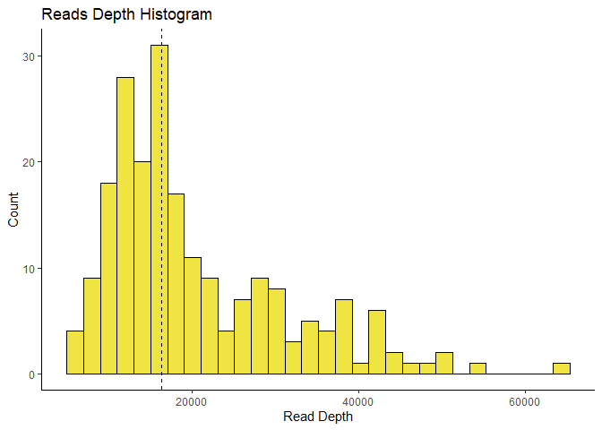

### Load in Libraries

```r
# DownLoad packages

if (!require("BiocManager", quietly = TRUE))
  install.packages("BiocManager")
```

```
## Warning: package 'BiocManager' was built under R version 4.2.3
```

```r
BiocManager::install("phyloseq")
```

```
## Bioconductor version 3.16 (BiocManager 1.30.20), R 4.2.2 (2022-10-31 ucrt)
```

```
## Warning: package(s) not installed when version(s) same as or greater than current; use
##   `force = TRUE` to re-install: 'phyloseq'
```

```
## Installation paths not writeable, unable to update packages
##   path: C:/Program Files/R/R-4.2.2/library
##   packages:
##     boot, class, codetools, foreign, lattice, MASS, Matrix, mgcv, nlme,
##     spatial, survival
```

```
## Old packages: 'cli', 'fastmap', 'gargle', 'htmltools', 'rhdf5', 'TH.data',
##   'xfun', 'zoo'
```

```r
#load libraries
library(phyloseq)
library(tidyverse)
```

```
## Warning: package 'ggplot2' was built under R version 4.2.3
```

```
## Warning: package 'tibble' was built under R version 4.2.3
```

```
## Warning: package 'dplyr' was built under R version 4.2.3
```

```
## ── Attaching core tidyverse packages ──────────────────────── tidyverse 2.0.0 ──
## ✔ dplyr     1.1.1     ✔ readr     2.1.4
## ✔ forcats   1.0.0     ✔ stringr   1.5.0
## ✔ ggplot2   3.4.2     ✔ tibble    3.2.1
## ✔ lubridate 1.9.2     ✔ tidyr     1.3.0
## ✔ purrr     1.0.1
```

```
## ── Conflicts ────────────────────────────────────────── tidyverse_conflicts() ──
## ✖ dplyr::filter() masks stats::filter()
## ✖ dplyr::lag()    masks stats::lag()
## ℹ Use the ]8;;http://conflicted.r-lib.org/conflicted package]8;; to force all conflicts to become errors
```

```r
library(Biostrings)
```

```
## Loading required package: BiocGenerics
## 
## Attaching package: 'BiocGenerics'
## 
## The following objects are masked from 'package:lubridate':
## 
##     intersect, setdiff, union
## 
## The following objects are masked from 'package:dplyr':
## 
##     combine, intersect, setdiff, union
## 
## The following objects are masked from 'package:stats':
## 
##     IQR, mad, sd, var, xtabs
## 
## The following objects are masked from 'package:base':
## 
##     anyDuplicated, aperm, append, as.data.frame, basename, cbind,
##     colnames, dirname, do.call, duplicated, eval, evalq, Filter, Find,
##     get, grep, grepl, intersect, is.unsorted, lapply, Map, mapply,
##     match, mget, order, paste, pmax, pmax.int, pmin, pmin.int,
##     Position, rank, rbind, Reduce, rownames, sapply, setdiff, sort,
##     table, tapply, union, unique, unsplit, which.max, which.min
## 
## Loading required package: S4Vectors
## Loading required package: stats4
## 
## Attaching package: 'S4Vectors'
## 
## The following objects are masked from 'package:lubridate':
## 
##     second, second<-
## 
## The following objects are masked from 'package:dplyr':
## 
##     first, rename
## 
## The following object is masked from 'package:tidyr':
## 
##     expand
## 
## The following objects are masked from 'package:base':
## 
##     expand.grid, I, unname
## 
## Loading required package: IRanges
## 
## Attaching package: 'IRanges'
## 
## The following object is masked from 'package:lubridate':
## 
##     %within%
## 
## The following objects are masked from 'package:dplyr':
## 
##     collapse, desc, slice
## 
## The following object is masked from 'package:purrr':
## 
##     reduce
## 
## The following object is masked from 'package:phyloseq':
## 
##     distance
## 
## The following object is masked from 'package:grDevices':
## 
##     windows
## 
## Loading required package: XVector
## 
## Attaching package: 'XVector'
## 
## The following object is masked from 'package:purrr':
## 
##     compact
## 
## Loading required package: GenomeInfoDb
## 
## Attaching package: 'Biostrings'
## 
## The following object is masked from 'package:base':
## 
##     strsplit
```

```r
library(ggplot2)
library(vegan)
```

```
## Warning: package 'vegan' was built under R version 4.2.3
```

```
## Loading required package: permute
```

```
## Warning: package 'permute' was built under R version 4.2.3
```

```
## Loading required package: lattice
```

```
## Warning: package 'lattice' was built under R version 4.2.3
```

```
## This is vegan 2.6-4
```

```r
library(dplyr)
library(lme4)
```

```
## Warning: package 'lme4' was built under R version 4.2.3
```

```
## Loading required package: Matrix
```

```
## Warning: package 'Matrix' was built under R version 4.2.3
```

```
## 
## Attaching package: 'Matrix'
## 
## The following object is masked from 'package:S4Vectors':
## 
##     expand
## 
## The following objects are masked from 'package:tidyr':
## 
##     expand, pack, unpack
```

```r
library(emmeans)
```

```
## Warning: package 'emmeans' was built under R version 4.2.3
```

```r
library(multcomp)
```

```
## Warning: package 'multcomp' was built under R version 4.2.3
```

```
## Loading required package: mvtnorm
## Loading required package: survival
```

```
## Warning: package 'survival' was built under R version 4.2.3
```

```
## Loading required package: TH.data
```

```
## Warning: package 'TH.data' was built under R version 4.2.3
```

```
## Loading required package: MASS
```

```
## Warning: package 'MASS' was built under R version 4.2.3
```

```
## 
## Attaching package: 'MASS'
## 
## The following object is masked from 'package:dplyr':
## 
##     select
## 
## 
## Attaching package: 'TH.data'
## 
## The following object is masked from 'package:MASS':
## 
##     geyser
```

```r
##### Set global options #####

# no scientific notation
options(scipen=10000) 

# color blind pallet used throughout 
cbbPalette <- c("#000000", "#E69F00", "#56B4E9", "#009E73", "#F0E442", "#0072B2", "#D55E00", "#CC79A7")
```
### READ IN DATA STEPS

```r
###### Read in data ####

#Loading the mapping file metadata
samp_dat <- read.csv("Data_files/mapping_its.csv")
samp_dat <- samp_dat %>%
  filter(Crop == "Yr_1") # filter only wheat dataset, exclude other crops in yr2, yr3 of rotation
rownames(samp_dat) <- samp_dat$Sample_Name # format row names must match OTU table headers
SAMP.fungi <- phyloseq::sample_data(samp_dat)

# OTU table - 
otu <- read.csv("Data_files/otu_table_its.csv")
treatment <- factor(c("T1", "T2", "T3", "T4"))
rownames(otu) <- otu$OTU_ID # format row names must match OTU table headers
otu <- otu[,-1] # shifting to 1, numeric matrix
OTU.fungi <- phyloseq::otu_table(otu, taxa_are_rows = TRUE)

# Taxonomy
taxonomy.fungi <- read.csv("Data_files/taxonomy_table_its.csv")
rownames(taxonomy.fungi) <- taxonomy.fungi$OTU_ID
taxonomy.fungi2 <- taxonomy.fungi %>%
  subset(Kingdom == "Fungi")

TAX.fungi <- phyloseq::tax_table(as.matrix(taxonomy.fungi2))

# Fasta
#FASTA.fungi <- readDNAStringSet("ITS_all_crops.fasta", format="fasta", seek.first.rec=TRUE, use.names=TRUE)
```

```r
###### Create Initial Phyloseq object ######
fungi.unedited <- phyloseq::phyloseq(OTU.fungi, TAX.fungi, SAMP.fungi)
str(fungi.unedited)
```

```
## Formal class 'phyloseq' [package "phyloseq"] with 5 slots
##   ..@ otu_table:Formal class 'otu_table' [package "phyloseq"] with 2 slots
##   .. .. ..@ .Data        : num [1:7233, 1:216] 437 1293 1035 15 2042 ...
##   .. .. .. ..- attr(*, "dimnames")=List of 2
##   .. .. .. .. ..$ : chr [1:7233] "F_OTU_20" "F_OTU_47" "F_OTU_1" "F_OTU_16" ...
##   .. .. .. .. ..$ : chr [1:216] "W_C1_T1_R1_L" "W_C1_T1_R1_R" "W_C1_T1_R1_S" "W_C1_T1_R2_L" ...
##   .. .. ..@ taxa_are_rows: logi TRUE
##   .. .. ..$ dim     : int [1:2] 7233 216
##   .. .. ..$ dimnames:List of 2
##   .. .. .. ..$ : chr [1:7233] "F_OTU_20" "F_OTU_47" "F_OTU_1" "F_OTU_16" ...
##   .. .. .. ..$ : chr [1:216] "W_C1_T1_R1_L" "W_C1_T1_R1_R" "W_C1_T1_R1_S" "W_C1_T1_R2_L" ...
##   ..@ tax_table:Formal class 'taxonomyTable' [package "phyloseq"] with 1 slot
##   .. .. ..@ .Data: chr [1:7233, 1:8] "F_OTU_20" "F_OTU_47" "F_OTU_1" "F_OTU_16" ...
##   .. .. .. ..- attr(*, "dimnames")=List of 2
##   .. .. .. .. ..$ : chr [1:7233] "F_OTU_20" "F_OTU_47" "F_OTU_1" "F_OTU_16" ...
##   .. .. .. .. ..$ : chr [1:8] "OTU_ID" "Kingdom" "Phylum" "Class" ...
##   .. .. ..$ dim     : int [1:2] 7233 8
##   .. .. ..$ dimnames:List of 2
##   .. .. .. ..$ : chr [1:7233] "F_OTU_20" "F_OTU_47" "F_OTU_1" "F_OTU_16" ...
##   .. .. .. ..$ : chr [1:8] "OTU_ID" "Kingdom" "Phylum" "Class" ...
##   ..@ sam_data :'data.frame':	216 obs. of  12 variables:
## Formal class 'sample_data' [package "phyloseq"] with 4 slots
##   .. .. ..@ .Data    :List of 12
##   .. .. .. ..$ : chr [1:216] "W_C1_T1_R1_L" "W_C1_T1_R1_R" "W_C1_T1_R1_S" "W_C1_T1_R2_L" ...
##   .. .. .. ..$ : chr [1:216] "Yr_1" "Yr_1" "Yr_1" "Yr_1" ...
##   .. .. .. ..$ : chr [1:216] "C1" "C1" "C1" "C1" ...
##   .. .. .. ..$ : chr [1:216] "T1" "T1" "T1" "T1" ...
##   .. .. .. ..$ : chr [1:216] "R1" "R1" "R1" "R2" ...
##   .. .. .. ..$ : chr [1:216] "Leaf" "Root" "Stem" "Leaf" ...
##   .. .. .. ..$ : chr [1:216] "Wheat_C1" "Wheat_C1" "Wheat_C1" "Wheat_C1" ...
##   .. .. .. ..$ : chr [1:216] "Wheat_T1" "Wheat_T1" "Wheat_T1" "Wheat_T1" ...
##   .. .. .. ..$ : chr [1:216] "T1_Leaf" "T1_Root" "T1_Stem" "T1_Leaf" ...
##   .. .. .. ..$ : chr [1:216] "aboveground" "belowground" "aboveground" "aboveground" ...
##   .. .. .. ..$ : chr [1:216] "Kalamazoo" "Kalamazoo" "Kalamazoo" "Kalamazoo" ...
##   .. .. .. ..$ : chr [1:216] "chemical" "chemical" "chemical" "chemical" ...
##   .. .. ..@ names    : chr [1:12] "Sample_Name" "Crop" "Collection" "Treatment" ...
##   .. .. ..@ row.names: chr [1:216] "W_C1_T1_R1_L" "W_C1_T1_R1_R" "W_C1_T1_R1_S" "W_C1_T1_R2_L" ...
##   .. .. ..@ .S3Class : chr "data.frame"
##   ..@ phy_tree : NULL
##   ..@ refseq   : NULL
```
### DATA ANALYSIS

# # ALPHA DIVERSITY

```r
#plot_bar(fungi.unedited, fill = "Family")
# Subset the data by treatment and time period
physeq_sub <- fungi.unedited 
      
# Calculate alpha diversity metrics (Shannon, Simpson, and Observed OTUs) and print table
alpha_div <- estimate_richness(physeq_sub, measures=c("Shannon", "Simpson", "Observed"))
# Add treatment, collection time interval and tissue information to alpha diversity table
alpha_div <- cbind(Treatment = as.factor(sample_data(physeq_sub)$Treatment), 
                   Collection = as.factor(sample_data(physeq_sub)$Collection),
                   Tissue = as.factor(sample_data(physeq_sub)$Tissue),
                   alpha_div)
# Calculate summary statistics for each alpha diversity metric 
alpha_div_summary <- alpha_div %>%
  group_by(Treatment, Collection, Tissue) %>%
  summarize(mean_shannon = mean(Shannon), 
            sd_shannon = sd(Shannon)) 
```

```
## `summarise()` has grouped output by 'Treatment', 'Collection'. You can override
## using the `.groups` argument.
```

```r
           # mean_simpson = mean(Simpson), 
            #sd_simpson = sd(Simpson), 
            #mean_observed = mean(Observed), 
            #sd_observed = sd(Observed))
#### ANOVA
lm.alphadiv <- (lm(mean_shannon ~ Treatment*Collection,data = alpha_div_summary))
summary(lm.alphadiv)
```

```
## 
## Call:
## lm(formula = mean_shannon ~ Treatment * Collection, data = alpha_div_summary)
## 
## Residuals:
##      Min       1Q   Median       3Q      Max 
## -0.56860 -0.23149 -0.01419  0.21677  0.75848 
## 
## Coefficients:
##                          Estimate Std. Error t value         Pr(>|t|)    
## (Intercept)               2.70758    0.21369  12.671 0.00000000000402 ***
## TreatmentT2              -0.05519    0.30220  -0.183           0.8566    
## TreatmentT3               0.04862    0.30220   0.161           0.8735    
## TreatmentT4               0.26695    0.30220   0.883           0.3858    
## CollectionC2              0.36861    0.30220   1.220           0.2344    
## CollectionC3             -0.29807    0.30220  -0.986           0.3338    
## TreatmentT2:CollectionC2  0.20409    0.42737   0.478           0.6373    
## TreatmentT3:CollectionC2  0.10610    0.42737   0.248           0.8061    
## TreatmentT4:CollectionC2 -0.15106    0.42737  -0.353           0.7268    
## TreatmentT2:CollectionC3  0.74316    0.42737   1.739           0.0949 .  
## TreatmentT3:CollectionC3  0.30431    0.42737   0.712           0.4833    
## TreatmentT4:CollectionC3 -0.51749    0.42737  -1.211           0.2377    
## ---
## Signif. codes:  0 '***' 0.001 '**' 0.01 '*' 0.05 '.' 0.1 ' ' 1
## 
## Residual standard error: 0.3701 on 24 degrees of freedom
## Multiple R-squared:  0.5383,	Adjusted R-squared:  0.3267 
## F-statistic: 2.544 on 11 and 24 DF,  p-value: 0.02704
```

```r
anova(lm.alphadiv)
```

```
## Analysis of Variance Table
## 
## Response: mean_shannon
##                      Df Sum Sq Mean Sq F value   Pr(>F)   
## Treatment             3 0.3975 0.13251  0.9673 0.424303   
## Collection            2 2.0945 1.04726  7.6450 0.002699 **
## Treatment:Collection  6 1.3416 0.22361  1.6323 0.181554   
## Residuals            24 3.2877 0.13699                    
## ---
## Signif. codes:  0 '***' 0.001 '**' 0.01 '*' 0.05 '.' 0.1 ' ' 1
```

```r
print(anova(lm.alphadiv))
```

```
## Analysis of Variance Table
## 
## Response: mean_shannon
##                      Df Sum Sq Mean Sq F value   Pr(>F)   
## Treatment             3 0.3975 0.13251  0.9673 0.424303   
## Collection            2 2.0945 1.04726  7.6450 0.002699 **
## Treatment:Collection  6 1.3416 0.22361  1.6323 0.181554   
## Residuals            24 3.2877 0.13699                    
## ---
## Signif. codes:  0 '***' 0.001 '**' 0.01 '*' 0.05 '.' 0.1 ' ' 1
```

```r
### Test ls means
smeans <- emmeans(lm.alphadiv, ~ Treatment | Collection) # estimate lsmeans of Treatment within Collection
Results_lsmeans <- cld(smeans, alpha = 0.05, reversed = TRUE, details = TRUE) # contrast with Tukey adjustment
Results_lsmeans
```

```
## $emmeans
## Collection = C1:
##  Treatment emmean    SE df lower.CL upper.CL .group
##  T4          2.97 0.214 24     2.53     3.42  1    
##  T3          2.76 0.214 24     2.32     3.20  1    
##  T1          2.71 0.214 24     2.27     3.15  1    
##  T2          2.65 0.214 24     2.21     3.09  1    
## 
## Collection = C2:
##  Treatment emmean    SE df lower.CL upper.CL .group
##  T3          3.23 0.214 24     2.79     3.67  1    
##  T2          3.23 0.214 24     2.78     3.67  1    
##  T4          3.19 0.214 24     2.75     3.63  1    
##  T1          3.08 0.214 24     2.64     3.52  1    
## 
## Collection = C3:
##  Treatment emmean    SE df lower.CL upper.CL .group
##  T2          3.10 0.214 24     2.66     3.54  1    
##  T3          2.76 0.214 24     2.32     3.20  12   
##  T1          2.41 0.214 24     1.97     2.85  12   
##  T4          2.16 0.214 24     1.72     2.60   2   
## 
## Confidence level used: 0.95 
## P value adjustment: tukey method for comparing a family of 4 estimates 
## significance level used: alpha = 0.05 
## NOTE: If two or more means share the same grouping symbol,
##       then we cannot show them to be different.
##       But we also did not show them to be the same. 
## 
## $comparisons
## Collection = C1:
##  contrast estimate    SE df t.ratio p.value
##  T1 - T2   0.05519 0.302 24   0.183  0.9978
##  T3 - T2   0.10381 0.302 24   0.344  0.9857
##  T3 - T1   0.04862 0.302 24   0.161  0.9985
##  T4 - T2   0.32214 0.302 24   1.066  0.7130
##  T4 - T1   0.26695 0.302 24   0.883  0.8134
##  T4 - T3   0.21833 0.302 24   0.722  0.8872
## 
## Collection = C2:
##  contrast estimate    SE df t.ratio p.value
##  T4 - T1   0.11588 0.302 24   0.383  0.9804
##  T2 - T1   0.14889 0.302 24   0.493  0.9600
##  T2 - T4   0.03301 0.302 24   0.109  0.9995
##  T3 - T1   0.15471 0.302 24   0.512  0.9554
##  T3 - T4   0.03883 0.302 24   0.128  0.9992
##  T3 - T2   0.00582 0.302 24   0.019  1.0000
## 
## Collection = C3:
##  contrast estimate    SE df t.ratio p.value
##  T1 - T4   0.25054 0.302 24   0.829  0.8402
##  T3 - T4   0.60346 0.302 24   1.997  0.2170
##  T3 - T1   0.35292 0.302 24   1.168  0.6523
##  T2 - T4   0.93851 0.302 24   3.106  0.0233
##  T2 - T1   0.68797 0.302 24   2.277  0.1319
##  T2 - T3   0.33504 0.302 24   1.109  0.6878
## 
## P value adjustment: tukey method for comparing a family of 4 estimates
```

```r
# Create the box plot Treatments
ggplot(alpha_div_summary, aes(x=Treatment, y=mean_shannon, fill=Collection)) + 
  geom_boxplot() +
  scale_fill_manual(values=c("#000000", "#E69F00", "#56B4E9", "#009E73", "#F0E442", "#0072B2", "#D55E00", "#CC79A7"),
                    labels=c("Vegetative", "Flowering", "Seed development")) +
  scale_x_discrete(labels=c("Conventional", "No till", "Low Input", "Organic")) +
  xlab("Treatment") + ylab("Shannon diversity index") +
  ggtitle("Alpha Diversity Boxplot")+
  theme_bw()
```

<!-- -->

```r
## Plot for Growth Stage (Collection)
```

# # Beta Diversity


